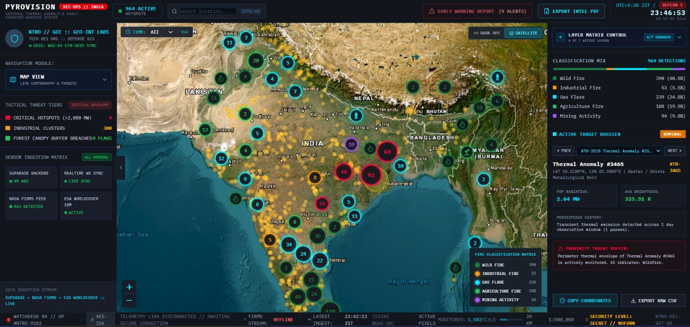
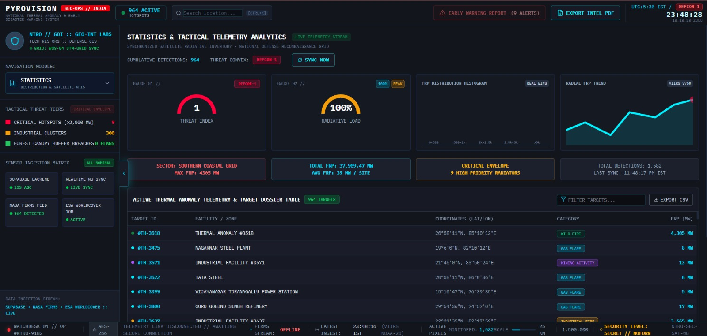
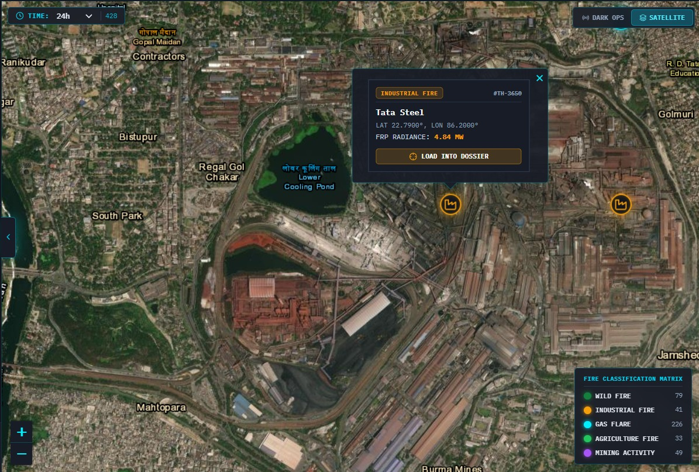
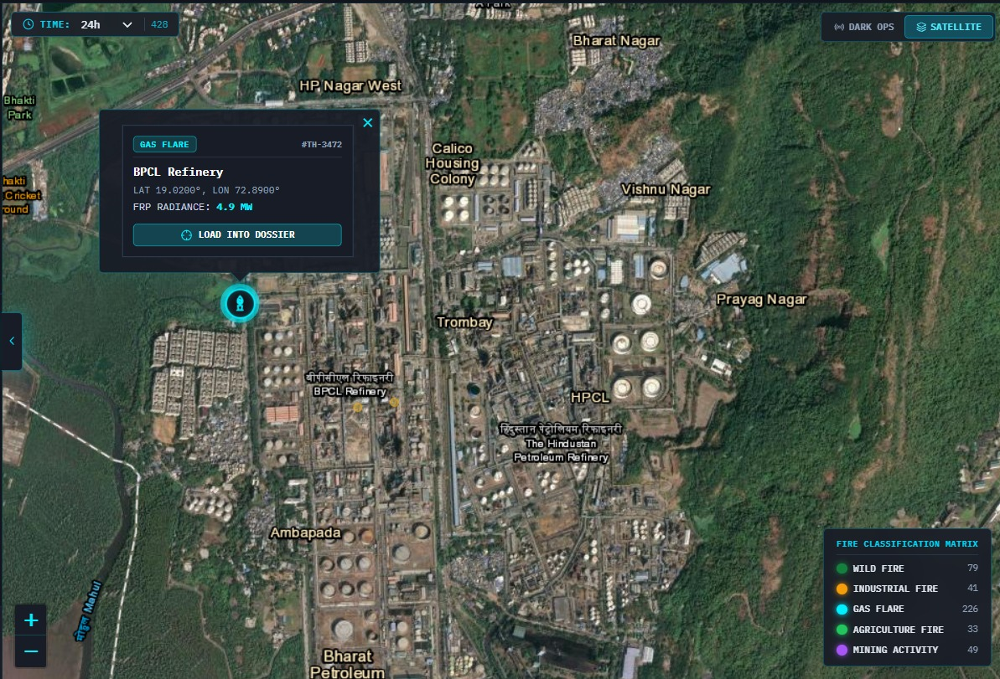
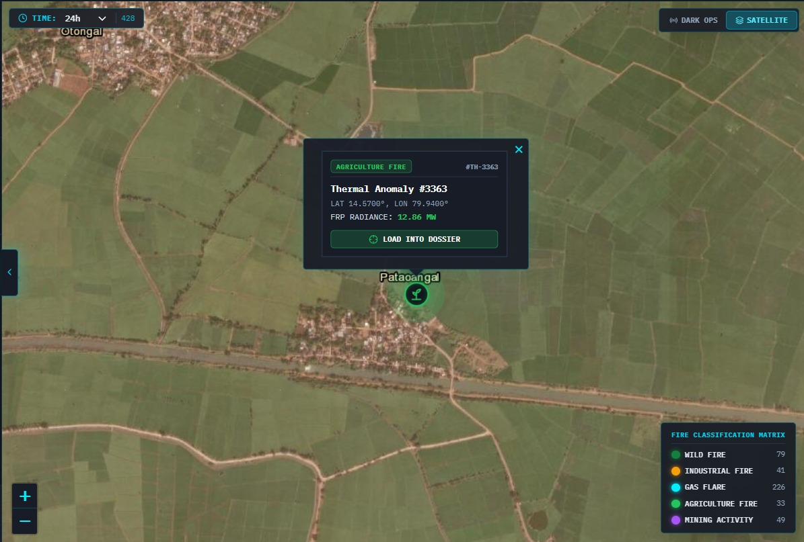
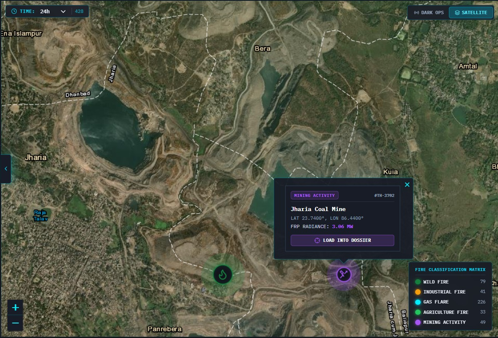
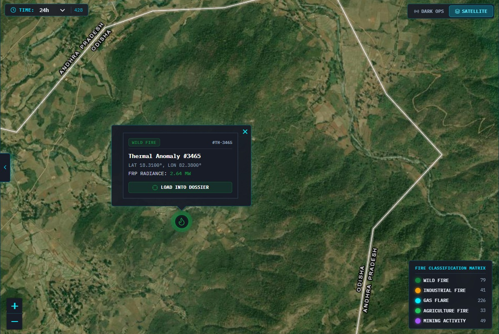

# 🔥 Pyrovision — AI-Based Thermal Anomaly Detection & Classification

<div align="center">

### 🛰️ Intelligent Geospatial Fire Detection & Classification System

**An AI-powered geospatial platform that detects, classifies, and verifies thermal anomalies using satellite data, land-cover context, spatial information, and government datasets.**

<br>

<a href="https://pyrovision-y5hm.vercel.app/">

</a>

<a href="https://supabase.com/">

</a>

<br><br>

**Smart India Hackathon 2026 · SIH26162 · NTRO · Disaster Management**

**Team Blaze Core**

</div>

---

## 🚀 Live Demo

<div align="center">

### 🌐 [Open Pyrovision Live Dashboard](https://pyrovision-y5hm.vercel.app/)

**Explore the interactive GIS dashboard, thermal hotspot classifications, statistics, satellite visualization and infrastructure context.**

</div>

---

# 👥 Team Blaze Core

| Member | Role | Contribution | Email
|---|---|---|---|
| **Kunal Kumar Vishwakarma** | Team Leader | Backend, Frontend & PPT | kunalvishwa123@gmail.com
| **Sanjeet** | Team Member | Dataset Researcher | codersanjeet07@gmail.com
| **Harsh Goyal** | Team Member | Frontend | harshgoyal89200@gmail.com
| **Anjali Rout** | Team Member | Context Research & PPT | anjalirout782@gmail.com
| **Yash Kumar** | Team Member | Technical Contributor | kumaryash8731@gmail.com
| **Yashika Chandra** | Team Member | Context Research |	yashikachandra06@gmail.com


---

# 🚨 The Problem

Satellite thermal monitoring systems such as **NASA FIRMS** can identify locations where thermal anomalies are detected, but a thermal hotspot alone does not directly reveal **what is causing it**.

A refinery fire, gas flare, crop-residue burning, mining activity, and wildfire can all appear as thermal anomalies.

This creates a major challenge for analysts who need to combine:

- Satellite observations
- Land-cover information
- Industrial infrastructure
- Power-plant locations
- Mining locations
- Historical persistence
- Thermal behaviour

to determine what a hotspot most likely represents.

### The core question is:

> **"The satellite detected heat — but what is actually causing it?"**

---

# 💡 Our Solution

**Pyrovision** combines satellite thermal observations with geospatial context, temporal behaviour, land-cover information, government records, and machine learning.

The system processes thermal hotspots and classifies them into **five operational categories**:

| Category | Description |
|---|---|
| 🏭 **Industrial Fire** | Thermal anomalies associated with industrial activity or facilities |
| 🔥 **Gas Flare** | Persistent thermal sources associated with gas/oil infrastructure |
| 🌾 **Agriculture Fire** | Agricultural and crop-residue burning |
| ⛏️ **Mining Activity** | Thermal activity associated with mining areas |
| 🌲 **Wild Fire** | Fire activity associated with vegetation and forest regions |

Pyrovision then visualizes the results through an interactive GIS dashboard.

---

# ⚡ How It Works

```text
                    🛰️ NASA FIRMS / VIIRS
                           │
                           ▼
                  Thermal Hotspot Data
                           │
                           ▼
                 🇮🇳 India Filtering
                           │
                           ▼
                 📍 Spatial Grouping
                           │
                           ▼
              ┌─────────────────────────┐
              │   Geospatial Context    │
              │                         │
              │ OSM     → Facilities    │
              │ WorldCover → Land Cover │
              │ CEA     → Power Plants  │
              │ WRI     → Power Plants  │
              │ Coal DB → Mining Sites  │
              └────────────┬────────────┘
                           │
                           ▼
                  📊 Feature Engineering
                           │
                           ▼
                 🤖 Random Forest ML
                           │
                           ▼
                🔎 Contextual Verification
                           │
                           ▼
                  🔥 Final Classification
                           │
                           ▼
                   🗄️ Supabase
                           │
                           ▼
                    ⚡ FastAPI
                           │
                           ▼
                 🌐 React + Leaflet
                           │
                           ▼
                  🗺️ GIS Dashboard
```

---

# 🏗️ Architecture Overview

```text
+-----------------------------------------------------------------------+
|                         NASA FIRMS / VIIRS                            |
|                    Satellite Thermal Observations                     |
+-----------------------------------+-----------------------------------+
                                    |
                                    v
+-----------------------------------------------------------------------+
|                       DATA INGESTION & FILTERING                      |
|                                                                       |
|       Raw Thermal Data → India Filtering → Spatial Grouping           |
+-----------------------------------+-----------------------------------+
                                    |
                                    v
+-----------------------------------------------------------------------+
|                       GEOSPATIAL CONTEXT                              |
|                                                                       |
|  OpenStreetMap   |   ESA WorldCover   |   CEA   |   WRI   |   Coal   |
|    Facilities    |     Land Cover     |  Power  |  Power  |  Mines   |
+-----------------------------------+-----------------------------------+
                                    |
                                    v
+-----------------------------------------------------------------------+
|                       FEATURE ENGINEERING                             |
|                                                                       |
| Days Active | Total Detections | Avg FRP | Max FRP | FRP Std. Dev.   |
| Average Brightness | Night Ratio | Temporal Persistence               |
+-----------------------------------+-----------------------------------+
                                    |
                                    v
+-----------------------------------------------------------------------+
|                       RANDOM FOREST MODEL                             |
|                                                                       |
|             Radiometric + Temporal Feature Classification             |
+-----------------------------------+-----------------------------------+
                                    |
                                    v
+-----------------------------------------------------------------------+
|                    CONTEXTUAL VERIFICATION                            |
|                                                                       |
|        Land Cover + Government Records + Spatial Context              |
+-----------------------------------+-----------------------------------+
                                    |
                                    v
+-----------------------------------------------------------------------+
|                       FINAL CLASSIFICATION                            |
|                                                                       |
|   🏭 Industrial Fire | 🔥 Gas Flare | 🌾 Agriculture Fire             |
|   ⛏️ Mining Activity | 🌲 Wild Fire                                  |
+-----------------------------------+-----------------------------------+
                                    |
                                    v
+-----------------------------------------------------------------------+
|                      SUPABASE / POSTGRESQL                            |
|                                                                       |
| Sites | Coordinates | Predictions | Features | Facility Information    |
+-----------------------------------+-----------------------------------+
                                    |
                                    v
+-----------------------------------------------------------------------+
|                         FASTAPI BACKEND                               |
|                     REST API / Data Services                          |
+-----------------------------------+-----------------------------------+
                                    |
                                    v
+-----------------------------------------------------------------------+
|                    REACT + LEAFLET DASHBOARD                          |
|                                                                       |
|   🗺️ Map | 📊 Statistics | 🔥 Classification | 🛰️ Satellite View     |
+-----------------------------------------------------------------------+
```

---

# ⚙️ Technical Workflow

## 1️⃣ 🛰️ Satellite Data Ingestion

Pyrovision uses **NASA FIRMS VIIRS thermal hotspot data** as the primary thermal input.

The incoming observations contain information such as:

- Latitude
- Longitude
- Acquisition date/time
- Brightness
- Fire Radiative Power (FRP)
- Day/night information
- Detection-related attributes

---

## 2️⃣ 🇮🇳 India Filtering & Spatial Grouping

The raw thermal observations are filtered to retain relevant observations within India.

Nearby detections are then grouped into representative hotspot sites.

### Current processing scale

```text
Thermal detections
        ↓
India filtering
        ↓
Spatial grouping
        ↓
965 representative sites
```

This allows Pyrovision to analyse a recurring thermal source as a site rather than treating every satellite observation as an independent event.

---

## 3️⃣ 🗺️ Geospatial Enrichment

Each hotspot is enriched using multiple spatial datasets.

| Dataset | Usage |
|---|---|
| **OpenStreetMap** | Industrial facility context |
| **ESA WorldCover** | Land-cover classification |
| **CEA** | Power-station verification |
| **WRI Global Power Plant Database** | Power-plant context |
| **Coal Mine Dataset** | Mining activity context |

### Spatial Matching

Industrial facilities are spatially matched using a **KDTree-based nearest-neighbour search** with a defined distance threshold.

---

## 4️⃣ 📊 Feature Engineering

Repeated thermal observations are converted into temporal and radiometric features.

| Feature | Purpose |
|---|---|
| **Days Active** | Measures hotspot persistence |
| **Total Detections** | Measures recurrence |
| **Average FRP** | Represents typical thermal intensity |
| **Maximum FRP** | Captures peak thermal intensity |
| **FRP Standard Deviation** | Measures thermal stability |
| **Average Brightness** | Represents thermal brightness |
| **Night Ratio** | Helps characterize persistent sources |

These features allow the model to capture differences between persistent and transient thermal behaviour.

---

## 5️⃣ 🤖 Random Forest Classification

Pyrovision uses a **Random Forest classifier** for the machine-learning stage.

The model receives engineered thermal and temporal features and generates an initial classification.

The model was benchmarked against multiple algorithms before selecting Random Forest for the final pipeline.

---

## 6️⃣ 🔎 Contextual Verification

Machine-learning output is not treated as the only source of information.

The prediction is further evaluated using:

```text
ML Prediction
     │
     ├── Land Cover
     │
     ├── Industrial Facilities
     │
     ├── Power Plants
     │
     ├── Coal Mines
     │
     └── Thermal Persistence
             │
             ▼
     Final Classification
```

This multi-source verification layer provides additional geographical context to the ML result.

---

## 7️⃣ 🗄️ Database Layer

Pyrovision uses **Supabase / PostgreSQL** to store processed information including:

- Hotspot sites
- Latitude / Longitude
- Temporal features
- Thermal statistics
- Predictions
- Facility information
- Verification context

---

## 8️⃣ ⚡ API Layer

The backend is built with **Python + FastAPI**.

It provides the frontend with:

- Hotspot information
- Classification results
- Geographic coordinates
- Statistics
- Facility context
- Prediction information

---

## 9️⃣ 🌐 GIS Visualization

The frontend is built with:

- React
- Vite
- Tailwind CSS
- Leaflet
- Recharts
- MapTiler

The dashboard provides an interactive environment for exploring thermal anomalies across the map.

---

# 🧠 AI / ML Architecture

```text
             RAW VIIRS OBSERVATIONS
                       │
                       ▼
              TEMPORAL AGGREGATION
                       │
                       ▼
             FEATURE ENGINEERING
                       │
       ┌───────────────┼────────────────┐
       │               │                │
       ▼               ▼                ▼
   Radiometric     Temporal        Behavioural
    Features        Features         Features
       │               │                │
       └───────────────┼────────────────┘
                       │
                       ▼
              RANDOM FOREST MODEL
                       │
                       ▼
                INITIAL PREDICTION
                       │
                       ▼
              CONTEXTUAL VERIFICATION
                       │
                       ▼
              FINAL FIRE CATEGORY
```

---

# 📊 Model Performance

| Metric | Result |
|---|---|
| **Algorithm** | Random Forest |
| **Accuracy** | **80.5%** |
| **Training Time** | < 1 second |
| **Inference Time** | 1–5 ms |
| **Model Size** | ~50–200 KB |

### Data Leakage Control

During model development, facility-distance-based features were removed from the training process to reduce spatial/contextual leakage.

The model was subsequently retrained using independent radiometric and temporal features.

> **Reported accuracy: 80.5% after leakage-controlled retraining.**

---

# 🚨 Severity & Alert Prioritization

Pyrovision uses thermal intensity and related information to categorize hotspot severity.

```text
                 Thermal Hotspot
                       │
                       ▼
                  FRP Analysis
                       │
            ┌──────────┼──────────┐
            ▼          ▼          ▼
        🔴 Critical  🟠 High   🟡 Elevated
```

Severity indicators are intended to help users prioritize hotspot investigation.

> Pyrovision is a decision-support system and does not replace emergency-response procedures or on-ground verification.

---

# ✨ Key Features

### 🛰️ Satellite Monitoring

Real-time/near-real-time thermal hotspot ingestion using NASA FIRMS data.

### 🧠 AI Classification

Machine-learning based classification using a lightweight Random Forest model.

### 🗺️ Geospatial Intelligence

Combines thermal observations with facilities, land cover, power plants, and mining locations.

### 📈 Persistence Analysis

Uses repeated observations to identify recurring thermal sources.

### 🏷️ Verification Context

Cross-references hotspot locations against government and geospatial datasets.

### 🚨 Severity Prioritization

Provides Critical, High, and Elevated severity levels based on thermal characteristics.

### 🌐 Interactive GIS Dashboard

Allows users to inspect hotspots directly on an interactive map.

### 📊 Analytics

Provides statistical views for understanding the detected thermal activity.

---

# 🛠️ Tech Stack

| Layer | Technology | Purpose |
|---|---|---|
| **Frontend** | React + Vite | Interactive web application |
| **UI** | Tailwind CSS | Interface styling |
| **GIS** | Leaflet | Interactive mapping |
| **Map Tiles** | MapTiler | Satellite/map visualization |
| **Charts** | Recharts | Statistics & analytics |
| **Backend** | Python + FastAPI | REST API |
| **Database** | Supabase + PostgreSQL | Data storage |
| **ML** | Random Forest + scikit-learn | Classification |
| **Data Processing** | Pandas | Data processing |
| **Scientific Computing** | SciPy | Spatial/analytical operations |
| **Spatial Search** | KDTree | Facility matching |
| **Deployment** | Vercel + Render | Cloud deployment |
| **Version Control** | Git + GitHub | Source control |

---

# 🌍 Data Sources

### 🛰️ NASA FIRMS

Thermal anomaly and active-fire observations.

https://firms.modaps.eosdis.nasa.gov/

### 🗺️ OpenStreetMap

Industrial facility and infrastructure information.

https://www.openstreetmap.org/

### 🌍 ESA WorldCover

Land-cover information used for contextual verification.

https://planetarycomputer.microsoft.com/dataset/esa-worldcover

### ⚡ Central Electricity Authority

Power-station information.

https://cea.nic.in/

### ⚡ WRI Global Power Plant Database

Power-plant information used for infrastructure context.

https://datasets.wri.org/datasets/global-power-plant-database

### ⛏️ Indian Coal Mine Dataset

Coal-mine location information.

https://www.kaggle.com/datasets/shitalgaikwad123/indian-coal-mines-dataset-january-20211

---

# ☁️ Deployment

Pyrovision is designed around a decoupled frontend/backend architecture.

```text
                 GitHub
                    │
          ┌─────────┴─────────┐
          │                   │
          ▼                   ▼
       Vercel              Render
          │                   │
          ▼                   ▼
      React App          FastAPI API
                              │
                              ▼
                         Supabase
                        PostgreSQL
```

### Frontend

**Vercel**

```text
https://pyrovision-y5hm.vercel.app/
```

### Backend

FastAPI backend can be deployed independently using services such as Render.

### Database

Supabase provides the PostgreSQL database layer.

---

# 📁 Project Structure

```text
Pyrovision/
│
├── backend/
│   ├── api/
│   ├── data/
│   ├── models/
│   └── requirements.txt
│
├── frontend/
│   ├── src/
│   ├── public/
│   ├── .env.example
│   └── package.json
│
├── models/
│   └── trained model files
│
├── images/
│   ├── Agricultural_Fire_Detection.png
│   ├── GIS_Dashboard_View.png
│   ├── Gas_Flare_Detection.png
│   ├── Industrial_Fire_Detection.png
│   ├── Mining_Activity_Detection.png
│   ├── Statistics_View.png
│   └── Wild_Fire_Detection.png
│
├── Ind_facility_database.csv
│
└── README.md
```

---

# 🚀 Quick Start

## 1. Clone Repository

```bash
git clone YOUR_GITHUB_REPOSITORY_URL
cd Pyrovision
```

---

## 2. Backend

```bash
cd backend

pip install -r requirements.txt

uvicorn api:app --reload
```

---

## 3. Frontend

Open another terminal:

```bash
cd frontend

npm install

npm run dev
```

---

# 🔐 Environment Variables

Create a `.env` file inside the `frontend/` directory.

```env
VITE_SUPABASE_URL=your_supabase_url
VITE_SUPABASE_ANON_KEY=your_supabase_anon_key
VITE_MAPTILER_API_KEY=your_maptiler_api_key
```

### `.env.example`

```env
VITE_SUPABASE_URL=
VITE_SUPABASE_ANON_KEY=
VITE_MAPTILER_API_KEY=
```

> ⚠️ **Never commit actual API keys, passwords, tokens, or credentials to GitHub.**

---

# 🎯 Potential Users

### 🛰️ NTRO

Potential use for monitoring thermal anomalies around mapped infrastructure and industrial facilities.

### 🚨 NDMA

Potential use for disaster-response coordination and hotspot investigation.

### 🌲 FSI

Potential use for contextual separation of vegetation-related fires from industrial, agricultural, mining, and other thermal sources.

### 🏭 Industrial Safety Teams

Potential use for monitoring thermal activity around industrial infrastructure.

> Pyrovision is intended as a decision-support and investigation platform. Final confirmation should involve appropriate ground-level or authoritative verification.

---

# ⚠️ Limitations

- Initial labels rely partly on facility and contextual assumptions rather than a comprehensive ground-truth fire-type dataset.
- OSM is community-driven and may contain incomplete or outdated facility information.
- VIIRS observations have finite spatial resolution, so a single thermal observation can represent multiple nearby structures or activities.
- Fixed spatial thresholds may produce mismatches in dense industrial regions.
- Satellite observations can be affected by observation timing, cloud cover, and sensor limitations.
- A thermal anomaly does not automatically indicate an emergency.
- Classification should therefore be interpreted as decision-support information rather than absolute ground truth.

### Risk Reduction

Pyrovision attempts to reduce these limitations through:

- Temporal persistence analysis
- Radiometric feature engineering
- Multi-source geospatial context
- Government dataset cross-referencing
- Spatial matching
- Post-classification verification

---

# 🖼️ Screenshots

## 🗺️ GIS Dashboard

<p align="center">
  
</p>

---

## 📊 Statistics View

<p align="center">
  
</p>

---

## 🏭 Industrial Fire Detection

<p align="center">
  
</p>

---

## 🔥 Gas Flare Detection

<p align="center">
  
</p>

---

## 🌾 Agricultural Fire Detection

<p align="center">
  
</p>

---

## ⛏️ Mining Activity Detection

<p align="center">
  
</p>

---

## 🌲 Wild Fire Detection

<p align="center">
  
</p>

---

# 🙏 Credits

### Frontend Foundation

This project builds upon the frontend foundation of:

**Harshgoyal001/pyrovision**

https://github.com/Harshgoyal001/pyrovision

### Data Sources

- NASA FIRMS
- OpenStreetMap
- ESA WorldCover
- Central Electricity Authority
- WRI Global Power Plant Database
- Indian Coal Mine Dataset

---

# 📚 References

- Vadrevu & Lasko — Remote Sensing, 2018
- Elvidge et al. — VIIRS Nightfire / Satellite Pyrometry at Night, 2013
- Hu et al. — Sentinel-2 + VIIRS gas flare detection, 2023
- OroraTech Wildfire Solution
- Google FireSat / Earth Fire Alliance
- FSI Fire Alert System (FAST 3.0)

---

<div align="center">

# 🔥 PYROVISION

### **From Thermal Anomaly → Context → Classification → Action**

**Team Blaze Core**

**Smart India Hackathon 2026 · SIH26162 · NTRO**

<br>

🌐 **[Launch Live Demo](https://pyrovision-y5hm.vercel.app/)**

</div>
